# Oi 

## ⚔️ Quem sou eu

Me chamo **Eduardo Nathan**, tenho **24 anos** e moro em **São Paulo**.  
Comecei como **Android Developer Junior** escrevendo Java e hoje sou **Frontend Developer**, sempre atrás de código mais limpo e bem arquitetado.

Fora do editor: 🎧 música, 🎨 desenho e 🤝 os amigos.

## 🖥️ ~/eduardo

## 🛠️ Stack

  

<table>
<tr>
<td align="center">⚒️ FERRAMENTAS</td>
<td align="center">💻 LINGUAGENS & PLATAFORMAS</td>
<td align="center">🧠 ESTUDANDO</td>
</tr>
<tr>
<td align="center">

 
 

</td>
<td align="center">

 
 

</td>
<td align="center">

 

</td>
</tr>
</table>

 

**Até logo** 

[⬆ voltar ao topo](#topo)

